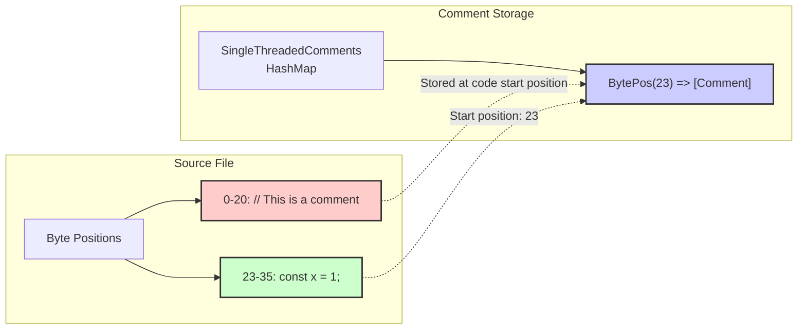
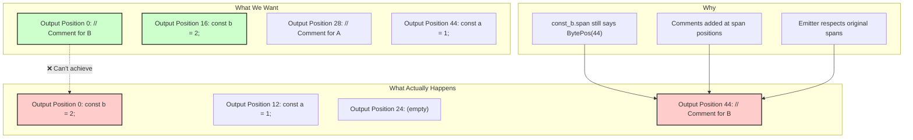
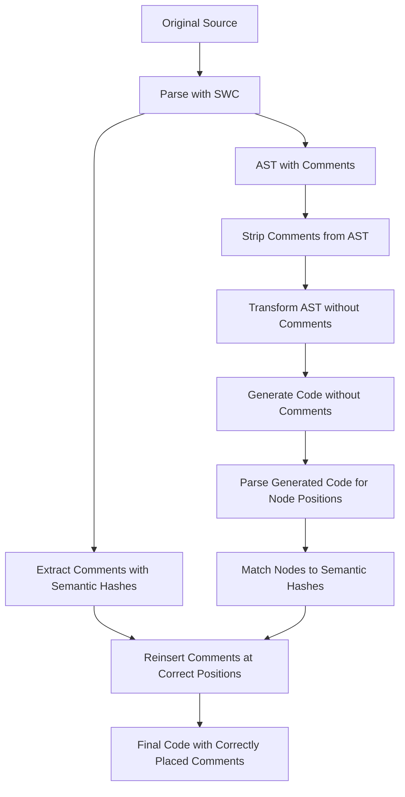
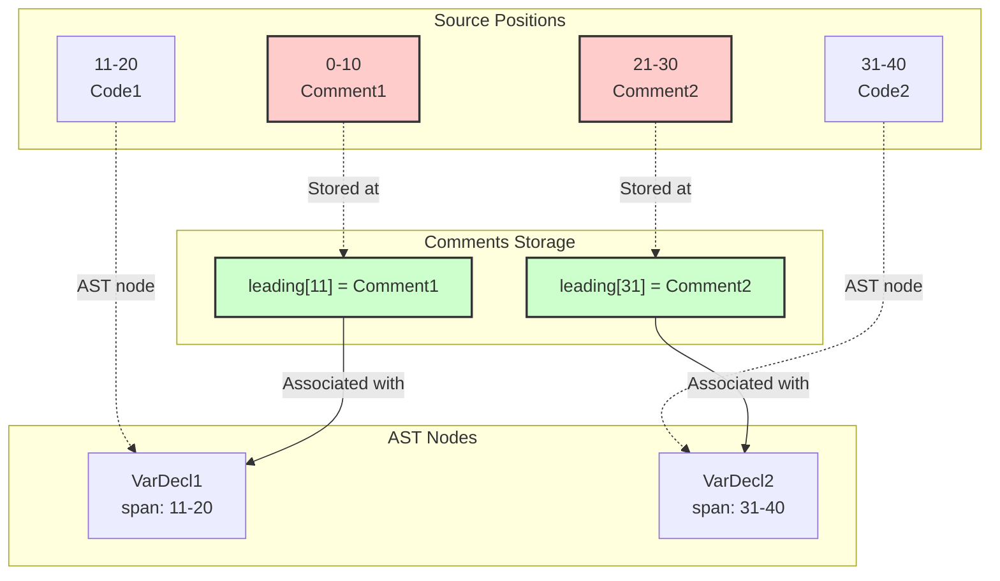
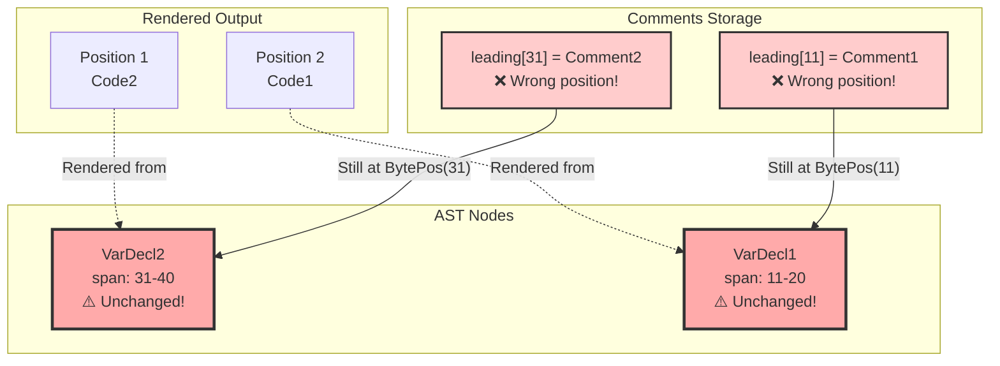
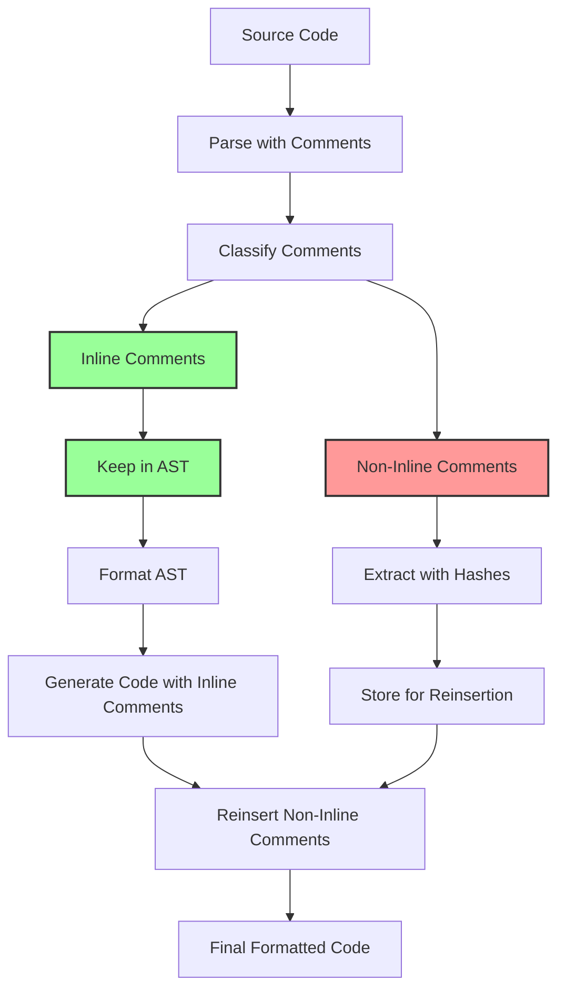

# Comment Preservation in krokfmt: From Problem to Solution

## Table of Contents

1. [Overview](#overview)
2. [The Problem](#the-problem)
3. [Understanding SWC's Architecture](#understanding-swcs-architecture)
4. [Why Traditional Solutions Don't Work](#why-traditional-solutions-dont-work)
5. [Attempted Solutions](#attempted-solutions)
6. [The Two-Phase Approach](#the-two-phase-approach)
7. [Technical Deep Dive](#technical-deep-dive)
8. [Code Examples](#code-examples)
9. [The Selective Comment Preservation Solution](#the-selective-comment-preservation-solution)
10. [Lessons Learned](#lessons-learned)
11. [Future Directions](#future-directions)

## Overview

One of the most challenging technical issues in krokfmt was the inability to properly preserve comment associations when reorganizing code through AST transformations. This document provides a comprehensive guide to understanding the problem, why it exists, the various solutions that were attempted, and the innovative selective comment preservation approach that ultimately solved it.

**UPDATE**: As of December 2024, krokfmt now uses a selective comment preservation system that keeps inline comments in the AST while extracting and reinserting other comments. This fundamental shift has resolved the core issues described in this document while maintaining perfect inline comment positioning.

## The Problem

When krokfmt reorganizes code (e.g., sorting imports, reordering exports, alphabetizing class members), comments that should logically move with their associated code remain at their original positions. This results in comments appearing in the wrong places or being associated with the wrong code elements.

### Example

Input:
```typescript
// Comment for export b
export const b = 2;

// Comment for export a  
export const a = 1;
```

Expected output (after alphabetical sorting):
```typescript
// Comment for export a
export const a = 1;

// Comment for export b
export const b = 2;
```

Actual output:
```typescript
// Comment for export b
export const a = 1;

// Comment for export a
export const b = 2;
```

## Understanding SWC's Architecture

To understand why this problem exists, we need to dive deep into how SWC (Speedy Web Compiler) handles comments and AST structures.

### What is an AST?

An Abstract Syntax Tree (AST) is a tree representation of source code structure. Each node in the tree represents a construct in the source code.

```typescript
// Source code
const x = 1 + 2;

// Simplified AST representation
VariableDeclaration {
  declarations: [
    VariableDeclarator {
      id: Identifier { name: "x" },
      init: BinaryExpression {
        left: Literal { value: 1 },
        operator: "+",
        right: Literal { value: 2 }
      }
    }
  ]
}
```

### Key SWC Concepts

#### 1. Spans
Every AST node in SWC has a `span` field that indicates where in the source code the node appears:

```rust
pub struct Span {
    pub lo: BytePos,  // Start position (byte offset)
    pub hi: BytePos,  // End position (byte offset)
    pub ctxt: SyntaxContext,  // Hygiene information
}
```

**Important**: Spans are immutable and do NOT include comments - only the actual code.

#### 2. Comment Storage

**Comments are NOT part of the AST nodes**. Instead, they are stored in a separate data structure called `SingleThreadedComments`:

```rust
pub struct SingleThreadedComments {
    leading: RefCell<FxHashMap<BytePos, Vec<Comment>>>,
    trailing: RefCell<FxHashMap<BytePos, Vec<Comment>>>,
}
```

### The Key Insight: Position-Based Storage

Comments are stored at the BytePos where their associated code STARTS, not where the comment itself appears:

```typescript
// Source with byte positions marked
// 00000000001111111111222222222233333333334
// 01234567890123456789012345678901234567890
   // This is a comment      <- Comment at bytes 0-20
   const x = 1;              <- Code starts at byte 23

// The comment is stored at BytePos(23), NOT BytePos(0)!
```



### How SWC's Comment System Works

1. **Parsing Phase**:
   - Comments are extracted and stored in a `SingleThreadedComments` structure
   - Each comment is associated with a BytePos (byte position in source)
   - Comments are categorized as "leading" or "trailing" based on position

2. **AST Structure**:
   - Each AST node has a `span` field containing start and end positions
   - These positions refer to the original source code locations
   - Spans are immutable and part of the node's identity

3. **Code Generation**:
   - The emitter walks the AST and generates code
   - At each node, it checks for comments at that node's span positions
   - Comments are emitted based on their stored BytePos

## Why Traditional Solutions Don't Work

### The Intuitive Approach That Fails

Many developers (including us) have tried this seemingly reasonable approach:

1. **Read all comments** - Walk the AST and collect all leading/trailing comments for each node
2. **Build association map** - Create a map of node → comments
3. **Remove comments** - Clear the comment storage
4. **Rearrange AST** - Reorder nodes as needed
5. **Reassociate comments** - Add comments back based on the association map

### Why It Fails: Immutable Spans

Here's a concrete example to illustrate the issue:

```typescript
// Original source file:
// Comment for A
const a = 1;
// Comment for B
const b = 2;
```

#### Initial State
```rust
// AST nodes with their spans (immutable!)
const_a: VarDecl { span: Span { lo: BytePos(16), hi: BytePos(28) }, ... }
const_b: VarDecl { span: Span { lo: BytePos(44), hi: BytePos(56) }, ... }

// Comment storage
leading[BytePos(16)] = ["Comment for A"]
leading[BytePos(44)] = ["Comment for B"]
```

#### After Reordering (Swapping Order)
```rust
// After reordering in the AST vector:
module.body = vec![const_b, const_a];

// BUT the spans are still:
const_b: VarDecl { span: Span { lo: BytePos(44), hi: BytePos(56) }, ... }
const_a: VarDecl { span: Span { lo: BytePos(16), hi: BytePos(28) }, ... }
```

#### The Problem
When trying to reassociate comments:
```rust
// We want to add "Comment for B" to const_b, which is now first
// But const_b.span.lo is still BytePos(44)!

comments.add_leading(const_b.span.lo, "Comment for B");
// This adds the comment at BytePos(44), not at the beginning of the file!
```

### Visual Representation of the Problem



## Attempted Solutions

Over the course of development, we attempted numerous solutions to this problem. Each taught us valuable lessons about the constraints we were working with.

### 1. Comment Map Tracking (July 2025)

**Approach**: Build a map of AST nodes to their associated comments before reorganization, then restore the associations afterward.

**Implementation**:
- Created mappings between node identities and their comments
- After AST transformation, tried to update comment positions

**Why it failed**: SWC's emitter still uses the original BytePos values from the AST nodes. Even though we knew which comments belonged to which nodes, we couldn't change where they were emitted.

### 2. Clear and Re-add Comments

**Approach**: Remove all comments from the comment store and re-add them at new positions after transformation.

**Implementation**:
```rust
// Clear all comments
comments.clear();
// After transformation, add comments at new positions
comments.add_leading(new_pos, comment);
```

**Why it failed**: The AST nodes still contained their original spans. Comments added at "new" positions were still emitted at the original locations because the emitter uses the span information from the AST nodes.

### 3. Synthetic Spans

**Approach**: Create new spans for reorganized AST nodes to reflect their new positions.

**Why it failed**: SWC's AST nodes are designed to be immutable. The span information is deeply embedded in the node structure and cannot be modified without reconstructing the entire AST.

### 4. Manual Comment Emission

**Approach**: Disable SWC's built-in comment emission and handle it manually during code generation.

**Why it failed**: This would require reimplementing SWC's entire comment emission system, including:
- Proper indentation handling
- Line break management
- Comment style preservation (line vs block comments)
- Integration with source maps

The complexity was prohibitive and would likely introduce more bugs than it solved.

### 5. Post-processing String Manipulation

**Approach**: Let SWC generate code with misplaced comments, then fix them with string manipulation.

**Why it failed**: 
- Too fragile - would need complex pattern matching for every possible scenario
- Would break source maps
- Could introduce syntax errors if not done perfectly
- Performance impact of parsing generated code

### 6. Comment Attacher Module (August 2025)

**Approach**: Create a sophisticated system to track comment associations through AST transformations.

**Implementation**:
```rust
pub struct CommentAttacher {
    node_comments: HashMap<NodeIdentity, Vec<AttachedComment>>,
    floating_comments: Vec<Comment>,
}

pub struct NodeIdentity {
    node_type: String,      // e.g., "FunctionDecl"
    name: Option<String>,   // e.g., function name
    context: String,        // Additional disambiguation
}
```

**Why it failed**: While the infrastructure was sound, the fundamental BytePos issue remained. Comments were duplicated, placed inline instead of on separate lines, or lost entirely.

### 7. Deep Cloning with Span Updates (August 2025)

**Approach**: Deep clone the AST with updated spans to reflect new positions.

**Implementation**:
1. Created `span_calculator.rs` to calculate new BytePos positions
2. Created `ast_rebuilder.rs` to deep clone the AST with updated spans
3. Modified the formatter to use this approach when comments are present

**Why it failed**: 
- While we successfully updated all spans in the AST, the comments are still stored in the original `SingleThreadedComments` structure with their original BytePos associations
- Simply updating node spans doesn't move the comments
- The comment store would need to be rebuilt with new BytePos mappings

### 8. Comment Migration (August 2025)

**Approach**: Building on span updating, attempt to migrate comments to their new positions.

**Implementation**:
1. Created `comment_migrator.rs` to move comments from old BytePos to new BytePos
2. Attempted to extract comments and re-add them at new positions

**Why it failed**:
- `SingleThreadedComments` doesn't provide a public API to iterate through all comments
- No way to get a list of all positions that have comments
- The internal storage is private and can't be accessed directly
- Would require O(n) scanning where n is file size in bytes

## The Two-Phase Approach (Historical)

After exhausting traditional approaches, we initially designed a two-phase solution that worked around SWC's limitations. This approach extracted ALL comments and attempted to reinsert them after transformation

### High-Level Overview



### Phase 1: Initial Parsing and Comment Extraction

1. Parse the source file using SWC
2. Walk the AST and for each node:
   - Generate a semantic hash (stable identifier)
   - Extract associated leading and trailing comments
   - Store mapping: `semantic_hash → comments[]`

### Phase 2: Comment-Free Transformation

1. Create a new `SingleThreadedComments` instance (empty)
2. Run normal krokfmt transformations on the AST
3. Generate code without any comments

### Phase 3: Comment Reinsertion

1. Parse the generated code to identify node positions
2. Walk the new AST and generate semantic hashes
3. Match hashes to extract original comments
4. Insert comments at appropriate positions in the string

### Semantic Hashing Algorithm

The semantic hash must be stable across AST transformations while being unique enough to avoid collisions.

```rust
struct SemanticHash {
    node_type: NodeType,        // Function, Class, Const, etc.
    name: Option<String>,       // Identifier if available
    signature: Option<String>,  // For functions: param types
    parent_hash: Option<u64>,   // Parent node's hash (for context)
}
```

Examples:
```typescript
// Hash: { type: "FunctionDecl", name: "processUser", signature: "(User) => void" }
export function processUser(user: User): void { }

// Hash: { type: "ClassDecl", name: "UserService", parent: null }
class UserService {
    // Hash: { type: "Method", name: "getUser", signature: "(number) => User", parent: "UserService" }
    getUser(id: number): User { }
}
```

## Technical Deep Dive

### The Reordering Problem Visualized

#### Before Reordering



#### After Reordering (Moving VarDecl2 before VarDecl1)



**Result**: Comments appear in wrong positions because comment positions are tied to the original BytePos values in the spans.

### Why This Architecture Exists

SWC's design makes sense for its primary use case: transforming code while preserving its structure. Most transformations (transpiling, minifying, etc.) modify code in-place without reordering. The position-based system works perfectly for these scenarios.

The trade-off is that structural transformations (like sorting imports or reordering declarations) require complex comment migration logic that SWC doesn't provide out of the box.

## Code Examples

### Reading Comments in Practice

```rust
use swc_common::comments::Comments;

// Get leading comments for a position
if let Some(comments) = comment_map.get_leading(node.span.lo) {
    for comment in comments {
        println!("Leading comment: {}", comment.text);
    }
}

// Get trailing comments for a position
if let Some(comments) = comment_map.get_trailing(node.span.hi) {
    for comment in comments {
        println!("Trailing comment: {}", comment.text);
    }
}
```

### The Core Problem Demonstrated

```rust
/// The core problem - why moving nodes doesn't move comments
fn demonstrate_reordering_problem() {
    // Original AST and comments:
    // Node A at BytePos(10-20), comment at leading[10]
    // Node B at BytePos(30-40), comment at leading[30]
    
    // After swapping nodes in AST:
    // Node B still has span(30-40) - span is immutable!
    // Node A still has span(10-20) - span is immutable!
    
    // So comments remain at:
    // leading[10] - originally for A, but now B is rendered first
    // leading[30] - originally for B, but now A is rendered second
    
    // Result: Comments appear with wrong nodes!
}
```

### Comment-Aware Visitor Pattern

```rust
impl VisitMut for CommentAwareTransformer {
    fn visit_mut_var_decl(&mut self, node: &mut VarDecl) {
        // Capture comments before transformation
        let leading = self.comments.get_leading(node.span.lo);
        let trailing = self.comments.get_trailing(node.span.hi);
        
        // Transform the node
        node.visit_mut_children_with(self);
        
        // Handle comment migration if needed
        if node.span != old_span {
            // Comments need special handling
        }
    }
}
```

### Tracking Comment Associations

```rust
struct CommentTracker {
    comments: SingleThreadedComments,
    position_map: std::collections::HashMap<BytePos, BytePos>,
}

impl CommentTracker {
    /// Collect all comments before transformation
    fn collect_comments(&self, span: Span) -> (Vec<Comment>, Vec<Comment>) {
        let leading = self.comments.get_leading(span.lo)
            .map(|c| c.to_vec())
            .unwrap_or_default();
        let trailing = self.comments.get_trailing(span.hi)
            .map(|c| c.to_vec())
            .unwrap_or_default();
        (leading, trailing)
    }
    
    /// Reapply comments at new positions
    fn apply_comments(&self, old_span: Span, new_span: Span, new_comments: &SingleThreadedComments) {
        // Get comments from old position
        let (leading, trailing) = self.collect_comments(old_span);
        
        // Add to new position
        for comment in leading {
            new_comments.add_leading(new_span.lo, comment);
        }
        for comment in trailing {
            new_comments.add_trailing(new_span.hi, comment);
        }
    }
}
```

## Lessons Learned

1. **Architecture Matters**: The choice of parser/AST library has profound implications that may not be apparent initially
2. **Comments are First-Class**: In a formatter, comments are as important as code and need first-class support
3. **Position vs. Structure**: Position-based systems are fundamentally incompatible with structural transformations
4. **Open Source Limitations**: When building on open-source tools, their architectural decisions become your constraints
5. **The Value of Documentation**: Understanding the underlying architecture is crucial for avoiding dead ends
6. **Innovation Through Constraints**: Sometimes the best solutions come from working around limitations rather than fighting them

## Future Directions

### Future Enhancements

1. **JSX Comment Support**: Add special handling for JSX comment syntax
2. **Smarter Classification**: Use more context to improve classification accuracy
3. **Comment Metrics**: Track statistics about comment preservation
4. **User Feedback**: Provide information about comment handling in verbose mode

### Alternative Approaches (No Longer Needed)

With the selective preservation approach working well, these alternatives are no longer necessary:
- Forking SWC to support node-based comments
- Switching to a different TypeScript parser
- Implementing custom code generation
- Restricting formatter capabilities

### Success Metrics for Any Solution

1. **Correctness**: 100% of comments remain with their nodes
2. **Performance**: <2x slowdown vs. regular formatting
3. **Compatibility**: Works with all TypeScript syntax
4. **Reliability**: Graceful fallback on edge cases

### Resolved Feature Impact

The selective preservation approach has resolved most comment-related issues:
- **FR1.4**: Import positioning - ✓ Comments now move correctly with imports
- **FR2.***: Export/visibility organization - ✓ Comments move with their exports
- **FR6.5**: Comment association - ✓ Comments stay with their associated code
- **FR3.3**: Class member ordering - ✓ Comments move with class members
- **FR6.7**: Inline comments - ✓ Perfect preservation of all inline comment types

Remaining minor issues:
- JSX comments require special syntax handling
- Some edge cases with standalone comment positioning

## The Selective Comment Preservation Solution

The breakthrough came from recognizing that inline comments have different preservation requirements than other comments. By keeping inline comments in the AST during transformation, we eliminate the most problematic cases of comment misplacement.

### The Key Insight

**Not all comments need to be extracted**. Comments that appear inline within expressions can remain in the AST during transformation, while only non-inline comments need the two-phase treatment.

### Comment Classification

Comments are now classified into four categories:

```rust
pub enum CommentClassification {
    Inline,      // Within expressions: const x = /* here */ 42
    Leading,     // Before statements
    Trailing,    // After statements on same line
    Standalone,  // Separated by blank lines
}
```

### Inline Comments

These comments remain in the AST and are never extracted:

```typescript
// Function parameters
function foo(/* param comment */ x: number) {}

// Variable declarations
const result = /* start value */ 10 + /* increment */ 5;

// Array elements
const arr = [/* first */ 1, /* second */ 2, /* third */ 3];

// Object properties
const obj = {
    key1: /* value1 */ "hello",
    key2: /* value2 */ "world"
};

// Type annotations
let nullable: /* can be null */ string | null;
```

### Non-Inline Comments

These are extracted and reinserted using the two-phase approach:

```typescript
// Leading comment before a declaration
const x = 42;

const y = 100; // Trailing comment at end of line

// Standalone comment separated by blank lines

/* Block comment on its own line */
function foo() {}
```

### Architecture

#### Key Components

1. **`comment_classifier.rs`**
   - Analyzes source code to classify each comment
   - Uses position and context to determine comment type
   - Handles edge cases like same-line mixed comments

2. **`selective_comment_handler.rs`**
   - Separates inline from non-inline comments
   - Creates a new `SingleThreadedComments` with only inline comments
   - Returns non-inline comments for extraction

3. **`selective_two_phase_formatter.rs`**
   - Implements the new formatting approach
   - Keeps inline comments in AST during transformation
   - Only applies two-phase process to non-inline comments

4. **`two_phase_formatter.rs`**
   - Updated to use selective approach when source is available
   - Falls back to old approach when source is unavailable

### Process Flow



### Implementation Details

#### Comment Classification Logic

The classifier examines:
- **Position**: Is the comment on the same line as code?
- **Context**: What tokens surround the comment?
- **Whitespace**: Are there blank lines before/after?

#### Selective Extraction Process

1. Iterate through all comments in the source
2. Classify each comment based on position and context
3. Create two comment containers:
   - Inline-only container (remains with AST)
   - Non-inline container (for extraction)

#### Code Generation

The code generator is initialized with the inline-only comments:

```rust
let generator = CodeGenerator::with_comments(source_map, inline_only_comments);
let code_with_inline = generator.generate(&formatted_ast)?;
```

This ensures inline comments are emitted naturally with their associated code.

### Benefits

1. **Perfect Inline Comment Preservation**: Comments within expressions never move
2. **Reduced Complexity**: Fewer comments need reinsertion logic
3. **Better Performance**: Less string manipulation and parsing
4. **Deterministic Output**: Eliminates non-deterministic comment ordering
5. **Works Within SWC**: No need to fork or modify the parser

### Edge Cases and Limitations

#### Resolved Issues

- Variable declaration inline comments: `const x = /* comment */ 42`
- Function parameter comments: `function(/* a */ x, /* b */ y)`
- Complex expression comments: `(/* a */ 10 + /* b */ 20) * /* c */ 30`
- Array and object literal comments

#### Remaining Challenges

1. **JSX Comments**: The {/* */} syntax needs special handling
2. **Type Alias Comments**: Comments separated by blank lines from type aliases
3. **Comment Association**: Some edge cases in determining which code a comment belongs to

## Conclusion

The comment preservation journey in krokfmt demonstrates the value of questioning fundamental assumptions. By recognizing that not all comments need to be treated the same way, we found a solution that works within SWC's constraints while providing superior results.

The selective comment preservation approach:
- Solves the inline comment problem completely
- Reduces the complexity of comment reinsertion
- Maintains compatibility with SWC's architecture
- Provides a foundation for future enhancements

This solution shows that sometimes the best engineering solutions come not from fighting constraints but from understanding them deeply and finding creative ways to work within them. The selective approach has transformed comment preservation from krokfmt's biggest challenge into one of its strengths.