# krokfmt Design Document

## Table of Contents
1. [Executive Summary](#executive-summary)
2. [System Architecture](#system-architecture)
3. [Core Components](#core-components)
4. [Data Flow](#data-flow)
5. [Detailed Component Design](#detailed-component-design)
6. [Formatting Rules Engine](#formatting-rules-engine)
7. [Performance Considerations](#performance-considerations)
8. [Error Handling Strategy](#error-handling-strategy)
9. [Testing Architecture](#testing-architecture)
10. [Future Extensibility](#future-extensibility)

## Executive Summary

krokfmt is a highly opinionated, zero-configuration TypeScript code formatter designed to enforce consistent code organization principles. Built in Rust for maximum performance, it leverages the SWC (Speedy Web Compiler) ecosystem for TypeScript parsing and code generation.

### Key Design Principles
- **Zero Configuration**: No options or configuration files - one true way to format
- **Performance First**: Rust implementation with parallel processing
- **Semantic Preservation**: Never changes program behavior
- **Predictable Output**: Deterministic formatting results
- **Progressive Enhancement**: Format what's possible, report what's not

## System Architecture

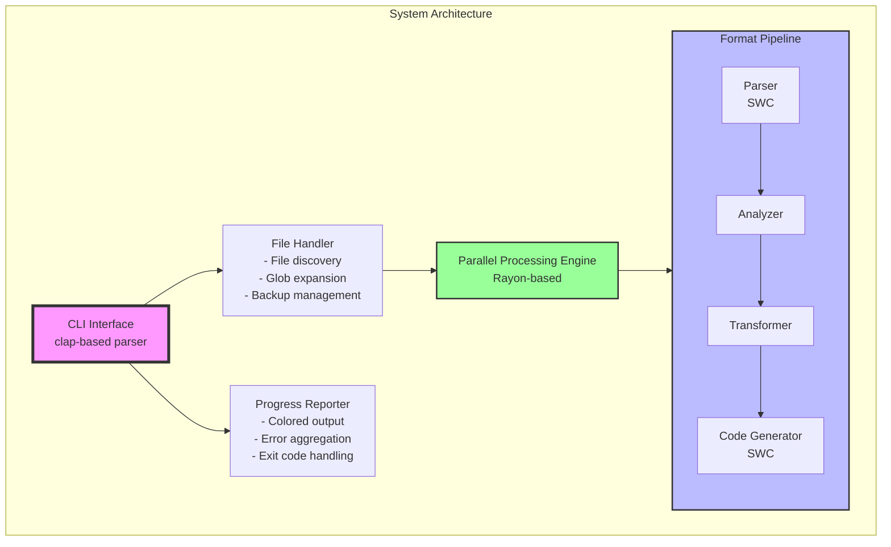

### Component Interaction Diagram

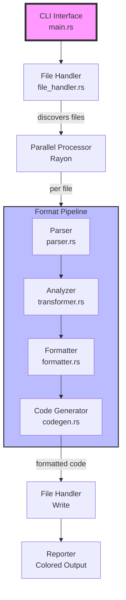

## Core Components

### 1. CLI Interface (`main.rs`)
Responsible for user interaction and orchestration:
- Argument parsing using `clap`
- File discovery coordination
- Progress reporting
- Exit code management

### 2. File Handler (`file_handler.rs`)
Manages all file system operations:
- TypeScript file discovery (`.ts`, `.tsx`, `.mts`, `.cts`)
- Directory traversal with exclusions (node_modules, hidden dirs)
- Glob pattern expansion
- Backup file creation
- Atomic file writing

### 3. Parser Module (`parser.rs`)
Wraps SWC's TypeScript parser:
- Configures parser for TypeScript/TSX syntax
- Manages source maps for accurate error reporting
- Handles syntax error recovery
- Supports all modern TypeScript features

### 4. Analyzer Module (`transformer.rs`)
Analyzes AST to extract formatting information:
- Import/export detection and categorization
- Dependency graph construction
- Member visibility analysis
- Sortable element identification

### 5. Transformer Module (`formatter.rs`)
Applies formatting rules to the AST:
- Import reorganization
- Property sorting
- Member reordering
- AST mutation with semantic preservation

### 6. Code Generator (`codegen.rs`)
Converts formatted AST back to source code:
- Custom emitter for import grouping
- Comment preservation
- Whitespace management
- Source map generation (future)

### Module Dependency Graph

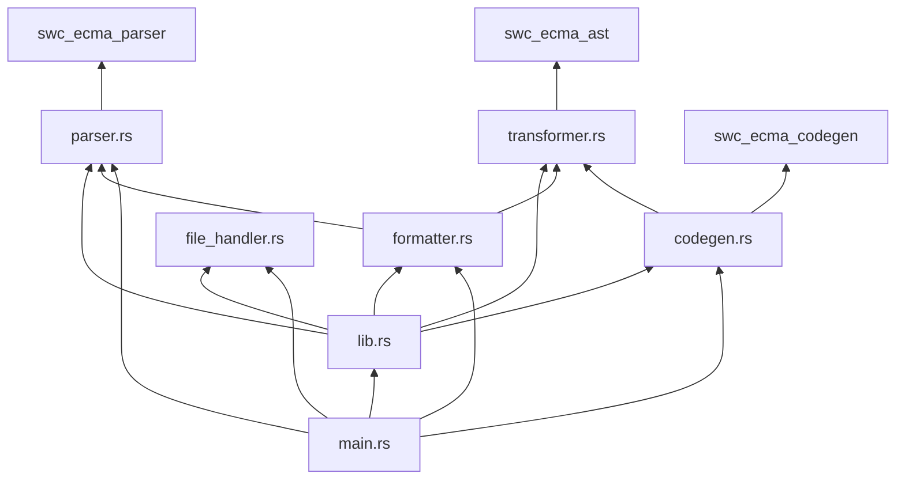

## Data Flow

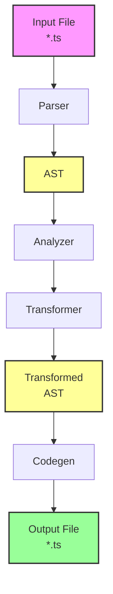

### AST Transformation Pipeline

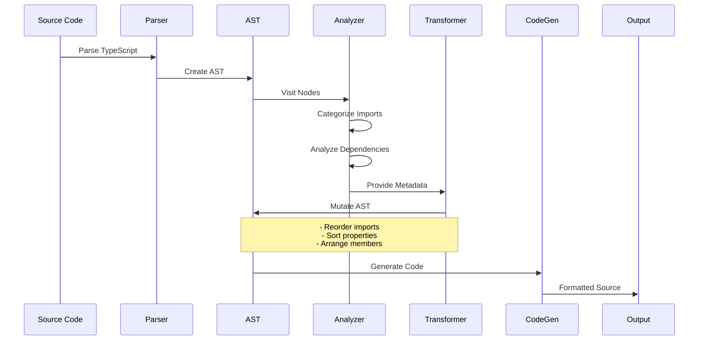

## Detailed Component Design

### Parser Configuration

```rust
pub struct TypeScriptParser {
    pub source_map: Arc<SourceMap>,
}

impl TypeScriptParser {
    pub fn parse(&self, source: &str, filename: &str) -> Result<Module> {
        let syntax = Syntax::Typescript(TsConfig {
            tsx: filename.ends_with(".tsx"),
            decorators: true,
            no_early_errors: true,
            ..Default::default()
        });
        // ... parsing logic
    }
}
```

Key features:
- Automatic TSX detection based on file extension
- Decorator support for modern TypeScript
- Error recovery for partial formatting
- Source map integration for accurate positioning

### Import Categorization Logic

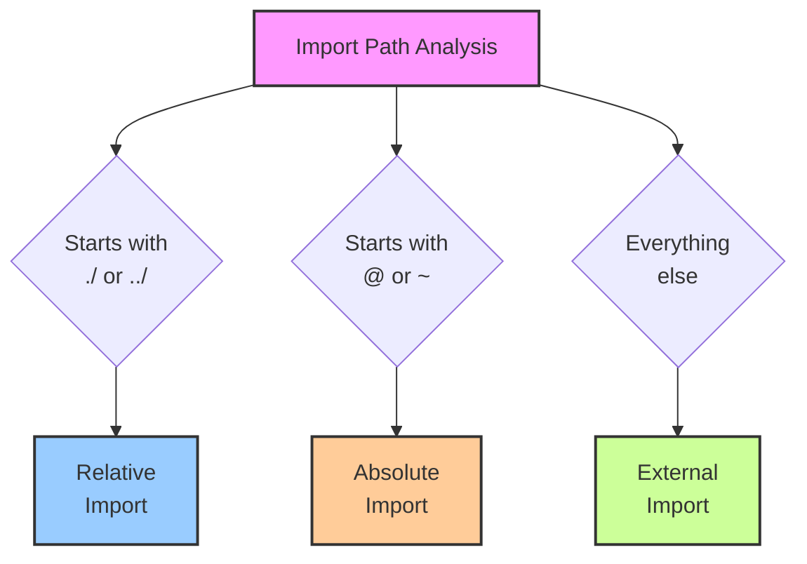

Categories are determined by path prefix:
- **External**: No special prefix (e.g., `react`, `lodash/debounce`)
- **Absolute**: Starts with `@` or `~` (e.g., `@utils/helper`)
- **Relative**: Starts with `./` or `../` (e.g., `./components/Button`)

### Import Processing Flow

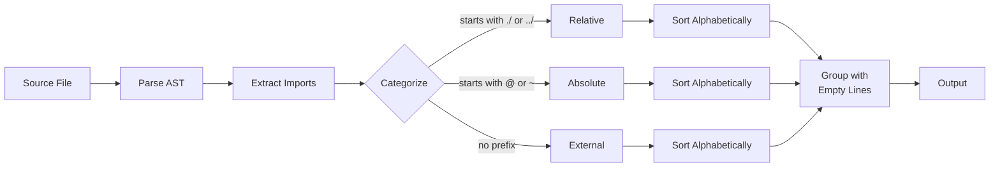

### AST Transformation Pipeline

```rust
pub struct FormatterVisitor;

impl VisitMut for FormatterVisitor {
    fn visit_mut_object_lit(&mut self, obj: &mut ObjectLit) {
        self.sort_object_props(&mut obj.props);
        obj.visit_mut_children_with(self);
    }
    
    fn visit_mut_call_expr(&mut self, call: &mut CallExpr) {
        self.sort_arguments(&mut call.args);
        call.visit_mut_children_with(self);
    }
    
    // Additional visitors for other sortable constructs
}
```

The visitor pattern allows for:
- Deep AST traversal
- In-place mutations
- Recursive formatting
- Extensible rule application

### Data Structure Relationships

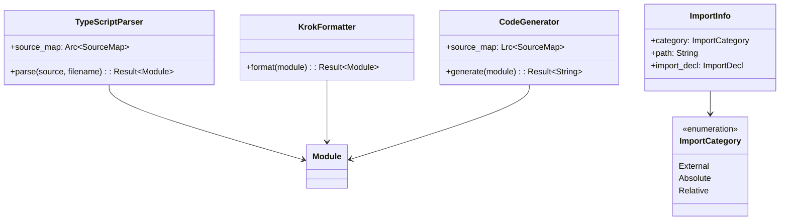

## Formatting Rules Engine

### Rule Categories

1. **Structural Rules** (affect file structure)
   - Import hoisting
   - Export grouping
   - Member visibility ordering

2. **Ordering Rules** (affect element order)
   - Import sorting by category and path
   - Object property alphabetization
   - Class member sorting

3. **Spacing Rules** (affect whitespace)
   - Empty lines between import groups
   - Consistent spacing around elements

### Rule Application Order

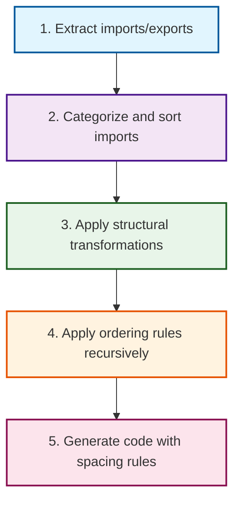

### Conflict Resolution

When rules conflict, precedence is:
1. Semantic preservation (never break code)
2. Structural rules
3. Ordering rules
4. Spacing rules

### Import Grouping Visualization

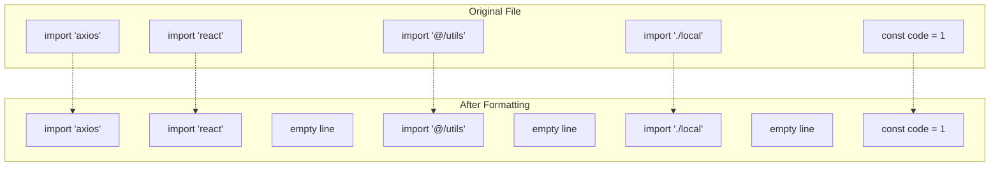

## Performance Considerations

### Parallel Processing Architecture

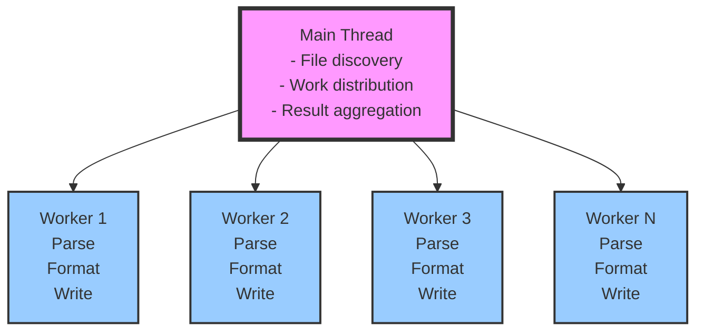

Optimizations:
- Rayon for automatic work-stealing parallelism
- Arc-wrapped source maps for shared access
- Minimal allocations during formatting
- Streaming file I/O

### Parallel Processing Workflow

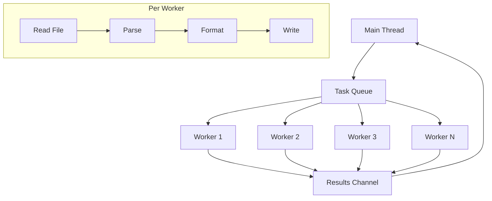

### Memory Management

- **Parser**: Reuses source map across files
- **AST**: In-place mutations where possible
- **Strings**: Cow<str> for efficient string handling
- **Buffers**: Pre-allocated for code generation

## Error Handling Strategy

### Error Categories

1. **Fatal Errors** (stop execution)
   - File system errors (permissions, disk full)
   - Invalid CLI arguments
   - Catastrophic parser failures

2. **File Errors** (skip file, continue)
   - Syntax errors
   - Unsupported TypeScript features
   - Encoding issues

3. **Formatting Warnings** (apply partial formatting)
   - Circular dependencies
   - Ambiguous sorting scenarios
   - Comment association issues

### Error Reporting

```mermaid
graph LR
    subgraph "Error Output Format"
        E1[✗ src/components/Button.tsx: Failed to parse file<br/>→ Unexpected token at line 42, column 15<br/>→ Expected '}' but found ']']
        
        E2[✗ src/utils/helper.ts: Circular dependency detected<br/>→ Cannot reorder members without breaking semantics<br/>→ Partial formatting applied]
        
        S[Summary: 2 errors, 148 files formatted successfully]
    end
    
    style E1 fill:#fdd,stroke:#c00,stroke-width:2px
    style E2 fill:#ffd,stroke:#cc0,stroke-width:2px
    style S fill:#dfd,stroke:#0c0,stroke-width:2px
```

### Error Handling Flow

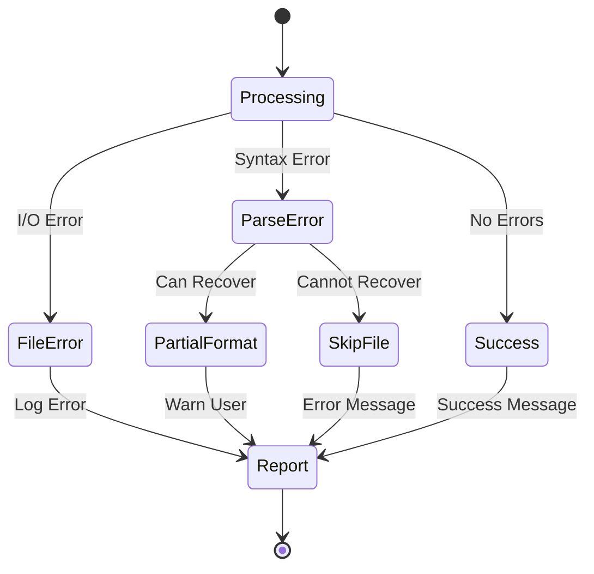

### File Processing State Machine

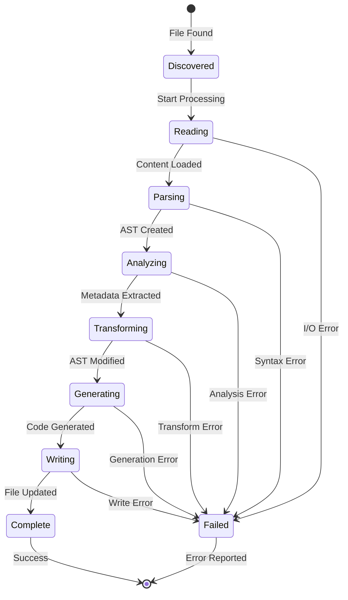

## Testing Architecture

### Test Categories

1. **Unit Tests** (per module)
   ```rust
   #[test]
   fn test_categorize_imports() {
       assert_eq!(
           ImportAnalyzer::categorize_import("react"),
           ImportCategory::External
       );
   }
   ```

2. **Integration Tests** (full pipeline)
   ```rust
   #[test]
   fn test_complete_formatting() {
       let input = load_fixture("messy.ts");
       let expected = load_fixture("clean.ts");
       assert_eq!(format_code(input), expected);
   }
   ```

3. **Property-Based Tests** (invariants)
   ```rust
   #[proptest]
   fn formatting_preserves_semantics(input: TypeScriptAst) {
       let formatted = format(input.clone());
       assert_eq!(evaluate(input), evaluate(formatted));
   }
   ```

4. **Snapshot Tests** (regression prevention)
   ```rust
   #[test]
   fn test_real_world_file() {
       let result = format_file("samples/react-component.tsx");
       insta::assert_snapshot!(result);
   }
   ```

### Test Data Organization

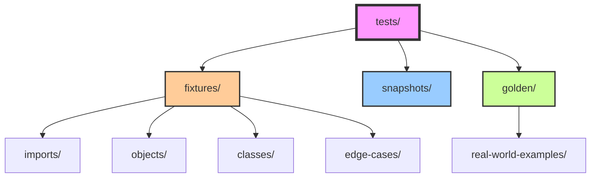

## Future Extensibility

### Plugin Architecture (Future)

```rust
trait FormattingRule {
    fn name(&self) -> &str;
    fn applicable(&self, node: &Node) -> bool;
    fn apply(&self, node: &mut Node) -> Result<()>;
}

struct RuleEngine {
    rules: Vec<Box<dyn FormattingRule>>,
}
```

### Incremental Formatting (Future)

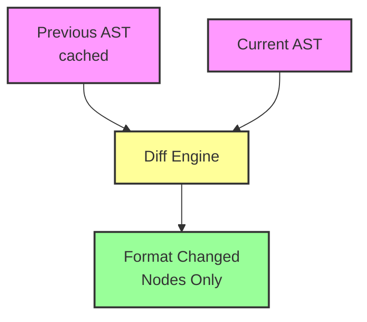

### Language Support Expansion

The architecture supports adding new languages by:
1. Implementing a new parser module
2. Adding language-specific rules
3. Extending the categorization logic
4. Updating file detection

### Editor Integration Points

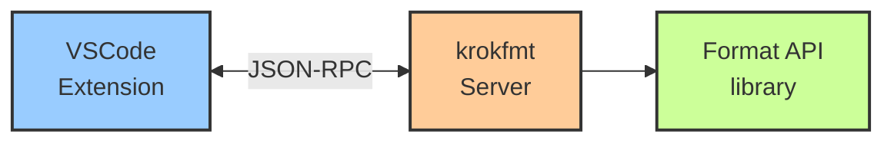

## Conclusion

krokfmt's design prioritizes simplicity, performance, and correctness. By leveraging Rust's performance characteristics and SWC's robust parsing capabilities, it provides a fast, reliable formatting solution that enforces consistent code organization principles without configuration overhead.