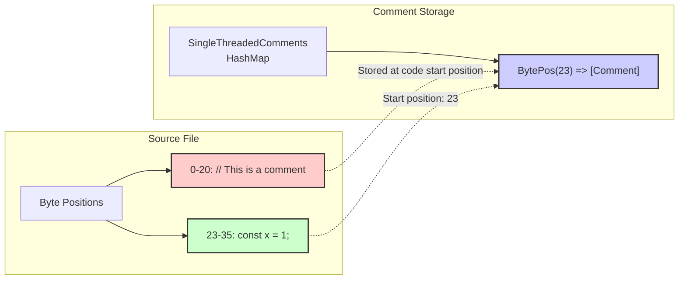
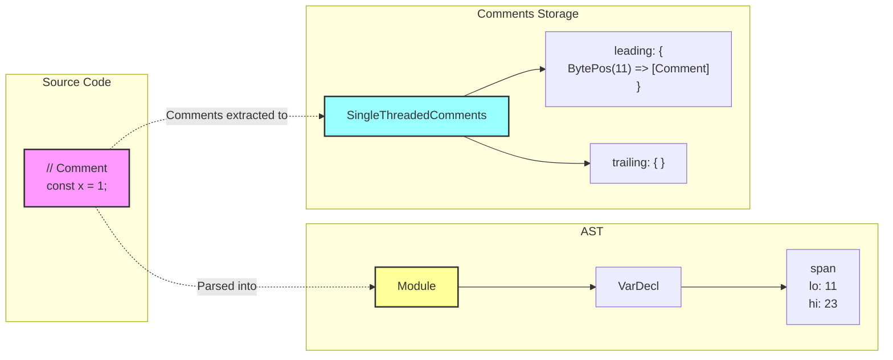
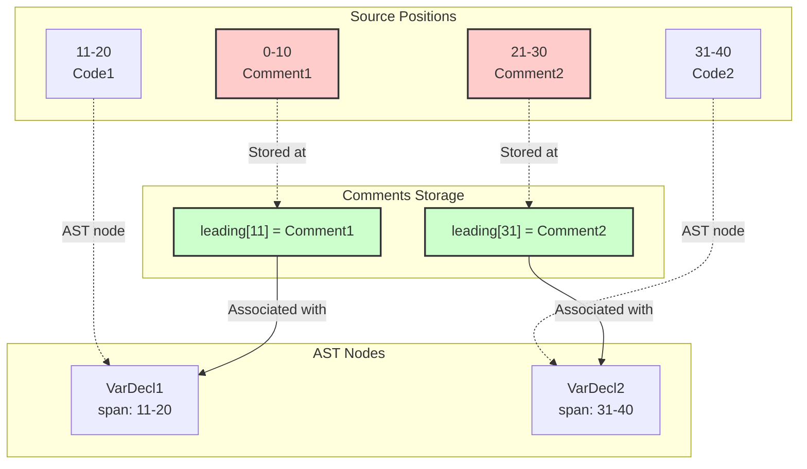
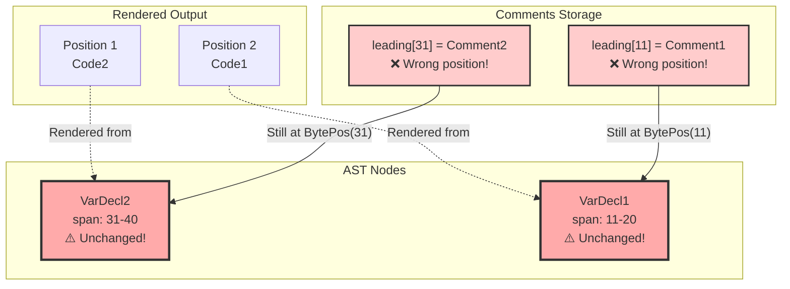

# Understanding SWC AST and Comment Handling

## Table of Contents
1. [Introduction](#introduction)
2. [SWC AST Basics](#swc-ast-basics)
3. [How Comments are Stored](#how-comments-are-stored)
4. [Comment Types and Positions](#comment-types-and-positions)
5. [Real-World Example with Byte Positions](#real-world-example-with-byte-positions)
6. [Working with Comments in Practice](#working-with-comments-in-practice)
7. [Rust Code Examples](#rust-code-examples)
8. [Common Pitfalls](#common-pitfalls)
9. [Advanced Techniques](#advanced-techniques)

## Introduction

SWC (Speedy Web Compiler) is a TypeScript/JavaScript compiler written in Rust. Unlike traditional AST representations where comments might be attached directly to nodes, SWC stores comments separately from the AST using a position-based system. This document explains how this system works and how to effectively work with it.

## SWC AST Basics

### What is an AST?

An Abstract Syntax Tree (AST) is a tree representation of source code structure. Each node in the tree represents a construct in the source code.

```typescript
// Source code
const x = 1 + 2;

// Simplified AST representation
VariableDeclaration {
  declarations: [
    VariableDeclarator {
      id: Identifier { name: "x" },
      init: BinaryExpression {
        left: Literal { value: 1 },
        operator: "+",
        right: Literal { value: 2 }
      }
    }
  ]
}
```

### Key SWC AST Concepts

#### 1. Spans
Every AST node in SWC has a `span` field that indicates where in the source code the node appears:

```rust
pub struct Span {
    pub lo: BytePos,  // Start position (byte offset)
    pub hi: BytePos,  // End position (byte offset)
    pub ctxt: SyntaxContext,  // Hygiene information
}
```

Example:
```typescript
// Source code with byte positions
// 0123456789012345
   const x = 1 + 2;
// ^^^^^^^^^^^^^^^
// Span { lo: 0, hi: 16 }
```

#### 2. BytePos
`BytePos` is a newtype wrapper around `u32` representing a byte offset in the source file:

```rust
#[derive(Copy, Clone, Eq, PartialEq, Ord, PartialOrd, Hash)]
pub struct BytePos(pub u32);
```

#### 3. Module Structure
The top-level AST node is typically a `Module`:

```rust
pub struct Module {
    pub span: Span,
    pub body: Vec<ModuleItem>,
    pub shebang: Option<JsWord>,
}
```

## How Comments are Stored

### The Key Insight: Separate Storage

**Comments are NOT part of the AST nodes**. Instead, they are stored in a separate data structure called `SingleThreadedComments`:

```rust
pub struct SingleThreadedComments {
    leading: RefCell<FxHashMap<BytePos, Vec<Comment>>>,
    trailing: RefCell<FxHashMap<BytePos, Vec<Comment>>>,
}
```

### Comment Structure

Each comment is represented as:

```rust
pub struct Comment {
    pub kind: CommentKind,
    pub span: Span,
    pub text: JsWord,
}

pub enum CommentKind {
    Line,   // Single-line comment: // comment
    Block,  // Multi-line comment: /* comment */
}
```

### Position-Based Storage

Comments are stored at the BytePos where their associated code STARTS, not where the comment itself appears:

```typescript
// Source with byte positions marked
// 00000000001111111111222222222233333333334
// 01234567890123456789012345678901234567890
   // This is a comment      <- Comment at bytes 0-20
   const x = 1;              <- Code starts at byte 23

// The comment is stored at BytePos(23), NOT BytePos(0)!
```



## Comment Types and Positions

### Leading Comments

Leading comments appear before a node and are stored at the node's start position:

```typescript
// Example 1: Simple leading comment
// 00000000001111111111222222222233333
// 01234567890123456789012345678901234
   // Leading comment for x
   const x = 1;

// Stored as: leading[BytePos(26)] = [Comment { text: " Leading comment for x" }]
```

```typescript
// Example 2: Multiple leading comments
// 00000000001111111111222222222233333333334444444
// 01234567890123456789012345678901234567890123456
   // First comment
   // Second comment
   const y = 2;

// Stored as: leading[BytePos(43)] = [
//   Comment { text: " First comment" },
//   Comment { text: " Second comment" }
// ]
```

### Trailing Comments

Trailing comments appear on the same line after code:

```typescript
// Example: Trailing comment
// 00000000001111111111222222222233333
// 01234567890123456789012345678901234
   const z = 3; // Trailing comment

// Stored as: trailing[BytePos(14)] = [Comment { text: " Trailing comment" }]
// Note: BytePos(14) is the END position of the statement
```

### Complex Example

```typescript
// Complete example with byte positions
// 000000000011111111112222222222333333333344444444445
// 012345678901234567890123456789012345678901234567890
   // Leading for import
   import { x } from './x'; // Trailing on import
   
   /* Block comment */
   // Leading for const
   const a = 1; // Trailing on const

// Storage:
// leading[BytePos(23)] = [Comment { text: " Leading for import" }]
// trailing[BytePos(47)] = [Comment { text: " Trailing on import" }]
// leading[BytePos(91)] = [Comment { text: " Block comment ", kind: Block }]
// leading[BytePos(91)] += [Comment { text: " Leading for const" }]
// trailing[BytePos(103)] = [Comment { text: " Trailing on const" }]
```

```mermaid
graph TB
    subgraph "Code Elements"
        Import["import { x } from './x';<br/>Span: 23-47"]
        Const["const a = 1;<br/>Span: 91-103"]
    end
    
    subgraph "Comment Storage Structure"
        STC["SingleThreadedComments"]
        
        subgraph "Leading Comments"
            L23["BytePos(23):<br/>- ' Leading for import'"]
            L91["BytePos(91):<br/>- ' Block comment '<br/>- ' Leading for const'"]
        end
        
        subgraph "Trailing Comments"
            T47["BytePos(47):<br/>- ' Trailing on import'"]
            T103["BytePos(103):<br/>- ' Trailing on const'"]
        end
    end
    
    Import -->|"Start pos"| L23
    Import -->|"End pos"| T47
    Const -->|"Start pos"| L91
    Const -->|"End pos"| T103
    
    STC --> Leading Comments
    STC --> Trailing Comments
    
    style Import fill:#ff9,stroke:#333,stroke-width:2px
    style Const fill:#ff9,stroke:#333,stroke-width:2px
    style L23 fill:#cfc,stroke:#333,stroke-width:2px
    style L91 fill:#cfc,stroke:#333,stroke-width:2px
    style T47 fill:#fcf,stroke:#333,stroke-width:2px
    style T103 fill:#fcf,stroke:#333,stroke-width:2px
```

## Working with Comments in Practice

### Reading Comments

To read comments using the `Comments` trait:

```rust
use swc_common::comments::Comments;

// Get leading comments for a position
if let Some(comments) = comment_map.get_leading(node.span.lo) {
    for comment in comments {
        println!("Leading comment: {}", comment.text);
    }
}

// Get trailing comments for a position
if let Some(comments) = comment_map.get_trailing(node.span.hi) {
    for comment in comments {
        println!("Trailing comment: {}", comment.text);
    }
}
```

### Adding Comments

```rust
use swc_common::comments::{Comment, CommentKind};

// Add a leading comment
comment_map.add_leading(
    node.span.lo,
    Comment {
        kind: CommentKind::Line,
        span: DUMMY_SP,
        text: " This is a new comment".into(),
    }
);
```

### Moving Comments (The Challenge)

When reorganizing AST nodes, comments don't automatically move because they're tied to BytePos:

```typescript
// Original code
// Comment for b
export const b = 2;
// Comment for a  
export const a = 1;

// After sorting exports alphabetically, AST nodes are reordered but comments stay at original positions:
// Comment for b    <- Still at original position!
export const a = 1;
// Comment for a    <- Still at original position!
export const b = 2;
```

### Diagram: Comment Storage Architecture



### Diagram: The Reordering Problem

#### Before Reordering



#### After Reordering (Moving VarDecl2 before VarDecl1)



**Result**: Comments appear in wrong positions because:
- Comment1 (for Code1) appears where Code2 is now rendered
- Comment2 (for Code2) appears at BytePos(31) which no longer exists in output

## Real-World Example with Byte Positions

Let's examine a real TypeScript file to see exactly how SWC stores comments:

```typescript
// This file demonstrates how SWC stores comments with byte positions marked

// Byte positions (for reference):
// 000000000111111111122222222223333333333444444444455555555556666666666
// 012345678901234567890123456789012345678901234567890123456789012345678

// Leading comment for import
import { foo } from './foo'; // Trailing on import

/* Block comment
   spanning multiple lines */
// Another leading comment
export const bar = 42; // Trailing on export

// Function with internal comments
function example() {
    // Comment inside function
    const x = 1;
    
    /* Multi-line inside function
       with more text */
    return x;
}

// Class with various comment positions
class Demo {
    // Comment on property
    name: string;
    
    // Comment on method
    method() {
        // Internal method comment
    }
}
```

### Detailed Byte Position Analysis

Let's analyze exactly where each comment is stored:

```
Line 7: "// Leading comment for import"
  - Comment spans bytes 116-145
  - But stored at BytePos(146) where "import" starts

Line 8: "import { foo } from './foo';"
  - Code spans bytes 146-174
  - Leading comment at BytePos(146)
  - Trailing comment at BytePos(174)

Line 8: "// Trailing on import"
  - Comment spans bytes 175-196
  - Stored as trailing at BytePos(174)

Lines 10-11: Block comment
  - Comment spans bytes 198-238
  - Stored at BytePos(268) where "export" starts

Key insight: Comments are ALWAYS stored at code positions,
never at their actual location in the source!
```

## Working with Comments in Practice
```

### 2. Forgetting Comments are at Code Start Positions

```typescript
// Source:
// Comment here
const x = 1;

// The comment is NOT at BytePos(0) where it appears
// It's at BytePos(14) where 'const' starts
```

### 3. Not Handling Multiple Comments

```rust
// Multiple comments can exist at the same position
// Always iterate through all comments:
if let Some(comments) = comment_map.get_leading(pos) {
    for comment in comments {  // Don't assume just one!
        // Process each comment
    }
}
```

### 4. Modifying Spans Doesn't Move Comments

```rust
// Changing a node's span doesn't move its comments
node.span = Span::new(BytePos(100), BytePos(200), DUMMY_SP);
// Comments are still at the original positions!
```

## Advanced Techniques

### 1. Comment Association Tracking

To maintain comment associations during transformations:

```rust
struct CommentAssociation {
    node_id: NodeId,
    leading: Vec<Comment>,
    trailing: Vec<Comment>,
}

// Before transformation: collect associations
let associations = collect_comment_associations(&ast, &comments);

// After transformation: reapply comments at new positions
apply_comment_associations(&new_ast, &associations, &mut new_comments);
```

### 2. Comment-Aware Visitors

When using the Visitor pattern, track comment positions:

```rust
impl VisitMut for CommentAwareTransformer {
    fn visit_mut_var_decl(&mut self, node: &mut VarDecl) {
        // Capture comments before transformation
        let leading = self.comments.get_leading(node.span.lo);
        let trailing = self.comments.get_trailing(node.span.hi);
        
        // Transform the node
        node.visit_mut_children_with(self);
        
        // Handle comment migration if needed
        if node.span != old_span {
            // Comments need special handling
        }
    }
}
```

### 3. Creating New Nodes with Comments

When creating synthetic nodes:

```rust
// Create node with DUMMY_SP
let new_node = VarDecl {
    span: DUMMY_SP,  // Placeholder span
    // ... other fields
};

// Calculate actual position in output
let position = calculate_position(&new_node);

// Add comments at the calculated position
comment_map.add_leading(position, Comment {
    kind: CommentKind::Line,
    span: DUMMY_SP,
    text: " Generated code".into(),
});
```

### 4. Comment Preservation Strategies

For tools that need to preserve comments during transformation:

1. **Minimal Transformation**: Only modify what's necessary, preserve spans
2. **Comment Extraction**: Extract all comments before transformation, reapply after
3. **Position Mapping**: Create a map of old positions to new positions
4. **Post-Processing**: Fix comment positions after code generation

## Rust Code Examples

### Example 1: Reading All Comments from a Module

```rust
use swc_common::{
    comments::{Comment, CommentKind, Comments, SingleThreadedComments},
    BytePos, Span, DUMMY_SP,
};
use swc_ecma_ast::*;
use swc_ecma_visit::{VisitMut, VisitMutWith};

fn print_all_comments(module: &Module, comments: &SingleThreadedComments) {
    println!("=== Analyzing Comments ===");
    
    // Walk through each item in the module
    for item in &module.body {
        let span = item.span();
        
        // Check for leading comments
        if let Some(leading) = comments.get_leading(span.lo) {
            println!("Leading comments at BytePos({}):", span.lo.0);
            for comment in leading {
                println!("  {} comment: '{}'", 
                    match comment.kind {
                        CommentKind::Line => "Line",
                        CommentKind::Block => "Block",
                    },
                    comment.text
                );
            }
        }
        
        // Check for trailing comments
        if let Some(trailing) = comments.get_trailing(span.hi) {
            println!("Trailing comments at BytePos({}):", span.hi.0);
            for comment in trailing {
                println!("  {} comment: '{}'", 
                    match comment.kind {
                        CommentKind::Line => "Line",
                        CommentKind::Block => "Block",
                    },
                    comment.text
                );
            }
        }
    }
}
```

### Example 2: Tracking Comment Associations During Transformation

```rust
struct CommentTracker {
    comments: SingleThreadedComments,
    // Map from old position to new position
    position_map: std::collections::HashMap<BytePos, BytePos>,
}

impl CommentTracker {
    /// Collect all comments before transformation
    fn collect_comments(&self, span: Span) -> (Vec<Comment>, Vec<Comment>) {
        let leading = self.comments.get_leading(span.lo)
            .map(|c| c.to_vec())
            .unwrap_or_default();
        let trailing = self.comments.get_trailing(span.hi)
            .map(|c| c.to_vec())
            .unwrap_or_default();
        (leading, trailing)
    }
    
    /// Reapply comments at new positions
    fn apply_comments(&self, old_span: Span, new_span: Span, new_comments: &SingleThreadedComments) {
        // Get comments from old position
        let (leading, trailing) = self.collect_comments(old_span);
        
        // Add to new position
        for comment in leading {
            new_comments.add_leading(new_span.lo, comment);
        }
        for comment in trailing {
            new_comments.add_trailing(new_span.hi, comment);
        }
    }
}
```

### Example 3: Comment-Aware Visitor for Sorting

```rust
/// Comment-aware visitor that preserves comments during sorting
struct SortingTransformer {
    comments: SingleThreadedComments,
}

impl VisitMut for SortingTransformer {
    fn visit_mut_module(&mut self, module: &mut Module) {
        // Example: Sort variable declarations alphabetically
        // while preserving their comments
        
        // First, collect all variable declarations with their comments
        let mut var_decls: Vec<(VarDecl, Vec<Comment>, Vec<Comment>)> = vec![];
        
        for item in &module.body {
            if let ModuleItem::Stmt(Stmt::Decl(Decl::Var(var_decl))) = item {
                let leading = self.comments.get_leading(var_decl.span.lo)
                    .map(|c| c.to_vec())
                    .unwrap_or_default();
                let trailing = self.comments.get_trailing(var_decl.span.hi)
                    .map(|c| c.to_vec())
                    .unwrap_or_default();
                    
                var_decls.push((var_decl.clone(), leading, trailing));
            }
        }
        
        // Sort by variable name
        var_decls.sort_by(|a, b| {
            let name_a = get_var_name(&a.0);
            let name_b = get_var_name(&b.0);
            name_a.cmp(&name_b)
        });
        
        // NOTE: In a real implementation, you would need to:
        // 1. Calculate new BytePos positions for the sorted declarations
        // 2. Create new spans with these positions
        // 3. Add comments at the new positions
        // This is where the complexity lies!
        
        module.visit_mut_children_with(self);
    }
}

fn get_var_name(var_decl: &VarDecl) -> String {
    var_decl.decls.first()
        .and_then(|d| match &d.name {
            Pat::Ident(ident) => Some(ident.id.sym.to_string()),
            _ => None,
        })
        .unwrap_or_default()
}
```

### Example 4: Detecting Floating Comments

```rust
/// Detecting "floating" comments (not attached to any node)
fn find_floating_comments(
    source_code: &str,
    module: &Module,
    comments: &SingleThreadedComments,
) -> Vec<(BytePos, Comment)> {
    let mut floating = vec![];
    let mut covered_positions = std::collections::HashSet::new();
    
    // Mark all positions that are covered by AST nodes
    struct PositionCollector {
        positions: std::collections::HashSet<BytePos>,
    }
    
    impl swc_ecma_visit::Visit for PositionCollector {
        fn visit_span(&mut self, span: &Span) {
            self.positions.insert(span.lo);
            self.positions.insert(span.hi);
        }
    }
    
    let mut collector = PositionCollector {
        positions: covered_positions,
    };
    use swc_ecma_visit::Visit;
    module.visit_with(&mut collector);
    
    // Check all possible positions for comments
    // (In practice, you'd need to iterate through the comment storage)
    // This is pseudo-code as SingleThreadedComments doesn't expose iteration
    /*
    for (pos, comments) in all_comments {
        if !collector.positions.contains(&pos) {
            for comment in comments {
                floating.push((pos, comment));
            }
        }
    }
    */
    
    floating
}
```

### Example 5: Adding Comments to Generated Code

```rust
fn add_generated_marker(module: &mut Module, comments: &SingleThreadedComments) {
    // Add a comment at the top of the file
    if let Some(first_item) = module.body.first() {
        comments.add_leading(
            first_item.span().lo,
            Comment {
                kind: CommentKind::Line,
                span: DUMMY_SP,
                text: " @generated - This file was auto-generated".into(),
            }
        );
    }
    
    // Add comments to each generated function
    for item in &mut module.body {
        if let ModuleItem::Stmt(Stmt::Decl(Decl::Fn(fn_decl))) = item {
            comments.add_leading(
                fn_decl.function.span.lo,
                Comment {
                    kind: CommentKind::Block,
                    span: DUMMY_SP,
                    text: " Generated function - do not edit ".into(),
                }
            );
        }
    }
}
```

### Example 6: The Core Problem Demonstrated

```rust
/// The core problem - why moving nodes doesn't move comments
fn demonstrate_reordering_problem() {
    // Original AST and comments:
    // Node A at BytePos(10-20), comment at leading[10]
    // Node B at BytePos(30-40), comment at leading[30]
    
    // After swapping nodes in AST:
    // Node B still has span(30-40) - span is immutable!
    // Node A still has span(10-20) - span is immutable!
    
    // So comments remain at:
    // leading[10] - originally for A, but now B is rendered first
    // leading[30] - originally for B, but now A is rendered second
    
    // Result: Comments appear with wrong nodes!
    
    println!("The fundamental issue:");
    println!("1. Node spans are immutable - they record original source positions");
    println!("2. Comments are stored by position, not by node reference");
    println!("3. When nodes are reordered, their spans don't change");
    println!("4. Therefore, comments stay at original positions");
}
```

### Example 7: A Theoretical Solution

```rust
/// A theoretical solution (not implementable with current SWC)
mod theoretical_solution {
    use super::*;
    
    // What we would need:
    struct NodeWithComments {
        node: ModuleItem,
        leading: Vec<Comment>,
        trailing: Vec<Comment>,
    }
    
    // Then we could:
    // 1. Extract nodes with their comments
    // 2. Sort/reorder the NodeWithComments
    // 3. Recalculate positions
    // 4. Rebuild AST with new spans
    // 5. Rebuild comment map with new positions
    
    // But SWC doesn't support:
    // - Mutable spans
    // - Iterating all comments
    // - Creating spans with arbitrary positions
}
```

## Why Can't We Just Reassociate Comments?

A common question is: "Why not just track comment associations and reapply them after reordering?" Here's why this doesn't work:

```mermaid
sequenceDiagram
    participant S as Source Code
    participant A as AST
    participant C as Comments
    participant O as Output
    
    Note over S: // Comment A<br/>const a = 1;<br/>// Comment B<br/>const b = 2;
    
    S->>A: Parse
    Note over A: const_a: span(16-28)<br/>const_b: span(44-56)
    
    S->>C: Extract Comments
    Note over C: leading[16] = "Comment A"<br/>leading[44] = "Comment B"
    
    Note over A: Reorder: [b, a]
    Note over A: ❌ Spans unchanged!<br/>const_b: span(44-56)<br/>const_a: span(16-28)
    
    A->>C: Try to reassociate
    Note over C: Still at old positions!<br/>leading[16] = "Comment A"<br/>leading[44] = "Comment B"
    
    A->>O: Generate Code
    Note over O: const b = 2; (from pos 44)<br/>const a = 1; (from pos 16)<br/><br/>Comments appear at<br/>original byte positions!
```

The fundamental issue: **You can move nodes in the AST, but their spans (and thus comment positions) remain unchanged.**

## Key Takeaways

1. **Comments are position-based, not node-based**: They're stored at BytePos locations, not attached to AST nodes
2. **Spans are immutable**: AST nodes keep their original spans even when moved
3. **Leading comments are stored at code start**: Not where the comment appears
4. **Multiple comments can exist at one position**: Always handle collections
5. **Transformations require explicit comment handling**: Moving nodes doesn't move comments
6. **SWC's design favors in-place transformations**: Major reordering is challenging

## Why This Design?

SWC's comment system is optimized for:
- **Performance**: Direct position lookup is fast
- **Streaming**: Can emit comments during single-pass code generation
- **Preservation**: Comments maintain exact positions for transformations that don't reorder

The trade-off is that structural transformations (like sorting imports or reordering declarations) require complex comment migration logic that SWC doesn't provide out of the box.

## Further Reading

- [SWC AST Documentation](https://rustdoc.swc.rs/swc_ecma_ast/)
- [SWC Comments Module](https://rustdoc.swc.rs/swc_common/comments/index.html)
- [SWC Parser Implementation](https://github.com/swc-project/swc/tree/main/crates/swc_ecma_parser)