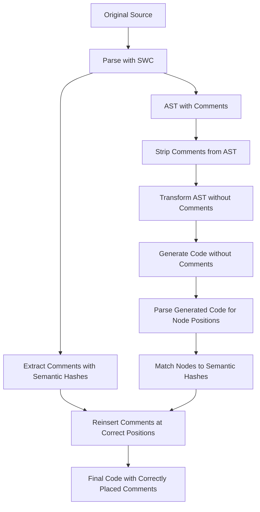

# Two-Phase Comment Replacement Design

## Overview

The two-phase comment replacement approach is an experimental solution to the comment attachment problem in krokfmt. It works around SWC's position-based comment system by temporarily removing comments during AST transformation, then reintegrating them based on semantic node matching.

## The Problem We're Solving

When krokfmt reorders code (sorting imports, organizing exports, etc.), comments remain at their original byte positions because:
1. SWC stores comments separately from the AST using byte positions
2. AST nodes retain their original spans even when reordered
3. The code generator emits comments based on these original positions

This results in comments appearing in the wrong places after code reorganization.

## High-Level Approach



## Detailed Phase Breakdown

### Phase 1: Initial Parsing and Comment Extraction

1. Parse the source file using SWC
2. Walk the AST and for each node:
   - Generate a semantic hash (stable identifier)
   - Extract associated leading and trailing comments
   - Store mapping: `semantic_hash → comments[]`

### Phase 2: Comment-Free Transformation

1. Create a new `SingleThreadedComments` instance (empty)
2. Run normal krokfmt transformations on the AST
3. Generate code without any comments

### Phase 3: Comment Reinsertion

1. Parse the generated code to identify node positions
2. Walk the new AST and generate semantic hashes
3. Match hashes to extract original comments
4. Insert comments at appropriate positions in the string

## Semantic Hashing Algorithm

The semantic hash must be stable across AST transformations while being unique enough to avoid collisions.

### Hash Components

```rust
struct SemanticHash {
    node_type: NodeType,        // Function, Class, Const, etc.
    name: Option<String>,       // Identifier if available
    signature: Option<String>,  // For functions: param types
    parent_hash: Option<u64>,   // Parent node's hash (for context)
}
```

### Examples

```typescript
// Hash: { type: "FunctionDecl", name: "processUser", signature: "(User) => void" }
export function processUser(user: User): void { }

// Hash: { type: "ClassDecl", name: "UserService", parent: null }
class UserService {
    // Hash: { type: "Method", name: "getUser", signature: "(number) => User", parent: "UserService" }
    getUser(id: number): User { }
}

// Hash: { type: "ArrowFunction", name: null, signature: "(string) => boolean", parent: "validateName" }
const validateName = (name: string) => name.length > 0;
```

### Handling Edge Cases

1. **Anonymous Functions**: Use signature and parent context
2. **Destructuring**: Include property names in hash
3. **Dynamic Names**: Use computed property indicator
4. **Overloads**: Include full signature with parameter names

## Comment Storage Format

```rust
struct ExtractedComment {
    semantic_hash: String,
    comment_type: CommentType,  // Leading or Trailing
    text: String,
    kind: CommentKind,         // Line or Block
    // Preserve relative positioning for multiple comments
    index: usize,              
}

enum CommentType {
    Leading,
    Trailing,
}
```

## Reinsertion Strategy

### String-Based Insertion

Since we can't modify BytePos values in the re-parsed AST, we work at the string level:

```rust
struct InsertionPoint {
    line: usize,
    column: usize,
    comment: ExtractedComment,
    indentation: String,
}
```

### Algorithm

1. **Build Line Map**: Split generated code into lines
2. **Locate Nodes**: Find each node's line/column position
3. **Calculate Insertion Points**:
   - Leading comments: Before node's line, matching indentation
   - Trailing comments: End of node's line
4. **Insert Comments**: Work backwards to avoid position shifts

### Indentation Handling

```rust
fn calculate_indentation(line: &str) -> String {
    line.chars()
        .take_while(|c| c.is_whitespace())
        .collect()
}
```

## Integration with Existing Pipeline

```rust
// In main.rs
if cli.experimental_comment_fix && has_comments {
    // Use two-phase formatter
    let formatted = TwoPhaseFormatter::format(module, source)?;
} else {
    // Use regular formatter
    let formatted = KrokFormatter::format(module)?;
}
```

## Performance Considerations

1. **Additional Parsing**: We parse twice (initial + generated code)
2. **String Manipulation**: More expensive than AST operations
3. **Memory Usage**: Store all comments and hashes

### Optimization Opportunities

1. **Lazy Hashing**: Only hash nodes with comments
2. **Streaming Insertion**: Process file in chunks
3. **Cache Semantic Hashes**: Reuse across runs

## Limitations and Edge Cases

### Known Limitations

1. **Floating Comments**: Comments not attached to any node
2. **Inline Comments**: Comments within expressions
3. **Multi-line Node Comments**: Comments inside node spans
4. **JSX Comments**: Special handling needed

### Fallback Strategy

If comment reinsertion fails:
1. Log warning
2. Fall back to regular formatting
3. Preserve original file

## Testing Strategy

### Snapshot Tests

Create fixtures for each scenario:
- Import reordering with comments
- Export reorganization with comments
- Class member sorting with comments
- Complex nested structures

### Property-Based Tests

1. Generate random AST with comments
2. Apply transformation
3. Verify comments remain associated

### Real-World Validation

Test on popular TypeScript projects:
- React
- Angular  
- NestJS
- TypeORM

## Future Enhancements

### Phase 2 Optimizations

1. **Incremental Hashing**: Only rehash changed nodes
2. **Comment Deduplication**: Handle moved duplicate code
3. **Smart Comment Migration**: Update comment content (e.g., JSDoc)

### Alternative Approaches

1. **AST Manipulation**: Modify SWC to support mutable spans
2. **Custom Emitter**: Replace SWC's code generator
3. **Preprocessing**: Transform comments to code before parsing

## Success Metrics

1. **Correctness**: 100% of comments remain with their nodes
2. **Performance**: <2x slowdown vs. regular formatting
3. **Compatibility**: Works with all TypeScript syntax
4. **Reliability**: Graceful fallback on edge cases

## Implementation Timeline

1. **Week 1**: Semantic hashing infrastructure
2. **Week 2**: Comment extraction and storage
3. **Week 3**: Reinsertion engine
4. **Week 4**: Integration and testing
5. **Week 5**: Performance optimization
6. **Week 6**: Edge case handling

## Conclusion

The two-phase comment replacement approach provides a pragmatic solution to the comment attachment problem. While it adds complexity and overhead, it enables correct comment preservation during code reorganization without requiring changes to SWC itself.