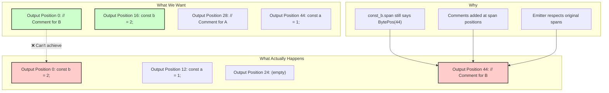

# Why Comment Reassociation Doesn't Work in SWC

## The Proposed Approach

Your suggested approach is exactly what many developers (including us) have tried:

1. **Read all comments** - Walk the AST and collect all leading/trailing comments for each node
2. **Build association map** - Create a map of node → comments
3. **Remove comments** - Clear the comment storage
4. **Rearrange AST** - Reorder nodes as needed
5. **Reassociate comments** - Add comments back based on the association map

This seems perfectly reasonable! Let's see why it fails.

## The Core Problem: Immutable Spans

Here's a concrete example to illustrate the issue:

```typescript
// Original source file:
// Comment for A
const a = 1;
// Comment for B
const b = 2;
```

### Step 1: Initial State

```rust
// AST nodes with their spans (immutable!)
const_a: VarDecl { span: Span { lo: BytePos(16), hi: BytePos(28) }, ... }
const_b: VarDecl { span: Span { lo: BytePos(44), hi: BytePos(56) }, ... }

// Comment storage
leading[BytePos(16)] = ["Comment for A"]
leading[BytePos(44)] = ["Comment for B"]
```

### Step 2: Build Association Map

```rust
let associations = HashMap::new();
associations.insert(const_a_id, vec!["Comment for A"]);
associations.insert(const_b_id, vec!["Comment for B"]);
```

### Step 3: Rearrange AST (swap order)

```rust
// After reordering in the AST vector:
module.body = vec![const_b, const_a];

// BUT the spans are still:
const_b: VarDecl { span: Span { lo: BytePos(44), hi: BytePos(56) }, ... }
const_a: VarDecl { span: Span { lo: BytePos(16), hi: BytePos(28) }, ... }
```

### Step 4: Try to Reassociate Comments

Here's where it breaks down:

```rust
// We want to add "Comment for B" to const_b, which is now first
// But const_b.span.lo is still BytePos(44)!

comments.add_leading(const_b.span.lo, "Comment for B");
// This adds the comment at BytePos(44), not at the beginning of the file!
```

## The Rendering Problem

When SWC's code generator runs, it processes nodes in order but uses their spans for positioning:

```rust
// Pseudo-code of what the emitter does:
for node in module.body {
    // Check for comments at this node's position
    if let Some(comments) = comments.get_leading(node.span.lo) {
        emit_comments(comments);
    }
    emit_node(node);
}
```

The emitter will:
1. Process `const_b` first (because we reordered it)
2. Look for comments at `BytePos(44)` (const_b's original position)
3. Not find any comments at the start of the file
4. Emit `const b = 2;` at the beginning
5. Later, when it reaches `BytePos(44)` in the output, emit the comment there

## Why Can't We Just Update the Spans?

You might think: "Just update the span when we move the node!" But:

1. **Spans are deeply immutable** - They're used for source mapping, error reporting, etc.
2. **No API to create arbitrary spans** - SWC doesn't let you create spans with custom BytePos values
3. **Span consistency** - Child nodes have spans too, all would need updating

## Visual Representation



## The Missing Piece: Position Calculation

What we really need is:

1. **Calculate new positions** - Figure out where each node will be in the output
2. **Create new spans** - Build spans with these new positions
3. **Rebuild the AST** - Create a new AST with updated spans
4. **Migrate comments** - Move comments to the new positions

But SWC doesn't provide:
- A way to calculate output positions before rendering
- An API to create spans with arbitrary BytePos values
- A way to deep-clone and modify an entire AST with new spans

## Code Example: Why Association Isn't Enough

```rust
// This is what we can do:
struct CommentAssociation {
    node_id: String,
    comments: Vec<Comment>,
}

// Collect associations
let mut associations = Vec::new();
for item in &module.body {
    let comments = collect_comments(item, &comment_storage);
    associations.push(CommentAssociation {
        node_id: get_node_id(item),
        comments,
    });
}

// Rearrange AST
module.body.sort_by(|a, b| /* some criteria */);

// Try to reapply - THIS IS WHERE IT FAILS
for item in &module.body {
    let association = find_association(&associations, item);
    for comment in association.comments {
        // item.span.lo is still the OLD position!
        comment_storage.add_leading(item.span.lo, comment);
    }
}
```

## The Fundamental Mismatch

SWC is designed for transformations that:
- Modify code in-place (transpiling, minifying)
- Preserve relative positions
- Don't reorder major structures

Your formatter needs transformations that:
- Reorder code blocks
- Move code across the file
- Maintain comment associations through movement

These are fundamentally different use cases, and SWC's architecture doesn't support the latter.

## Potential Solutions (All Complex)

1. **Custom Code Generator** - Write your own emitter that tracks positions
2. **Two-Pass System** - First pass to calculate positions, second to generate
3. **Fork SWC** - Modify it to support mutable spans or node-based comments
4. **Post-Process** - Generate code, parse output positions, move comments (fragile)

Each of these would be a major engineering effort with its own challenges.